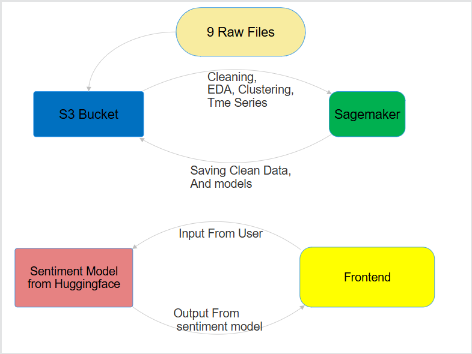
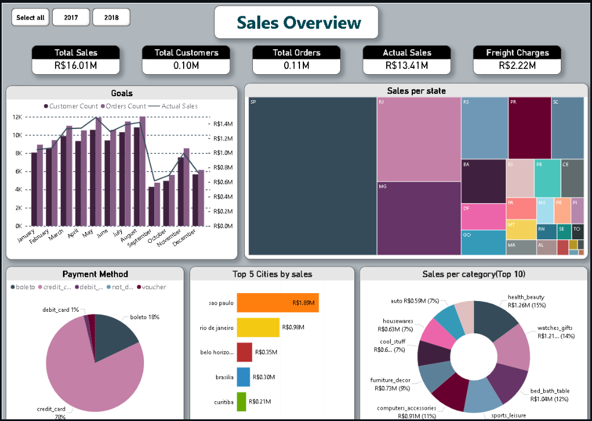
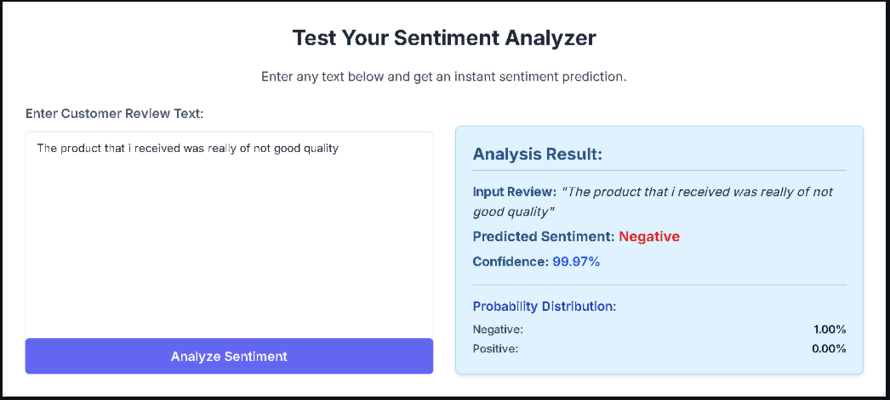
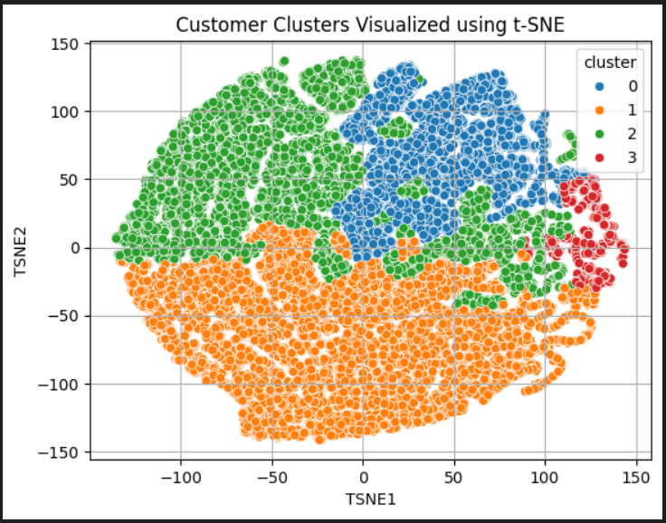
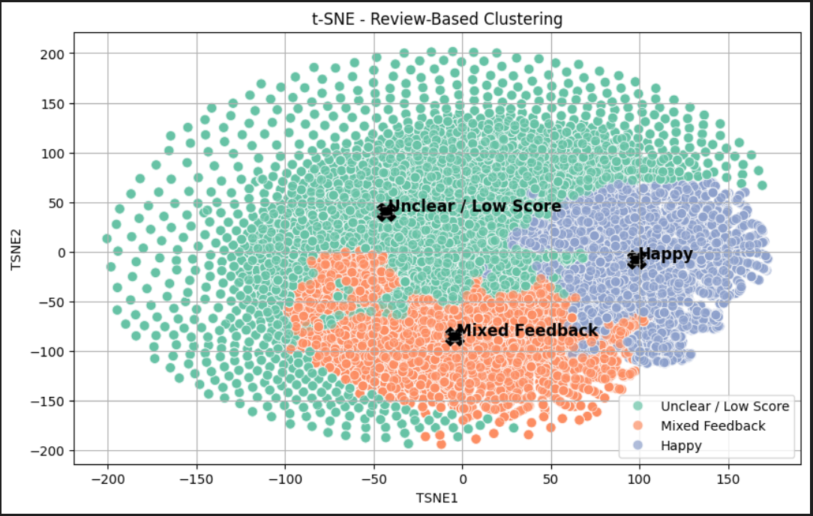
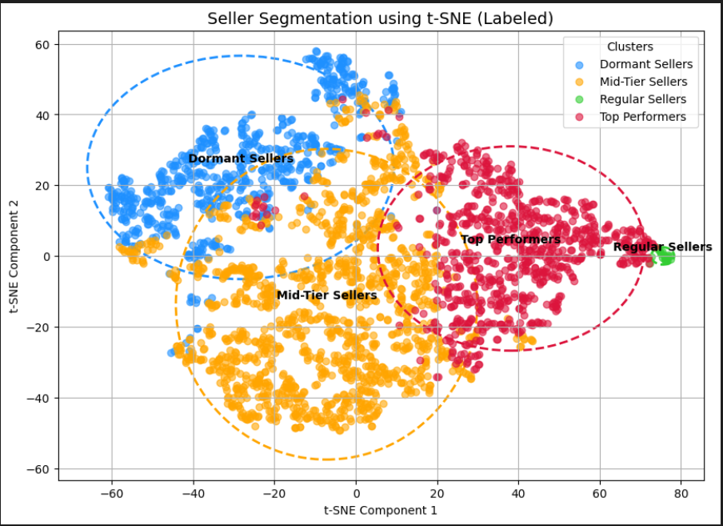
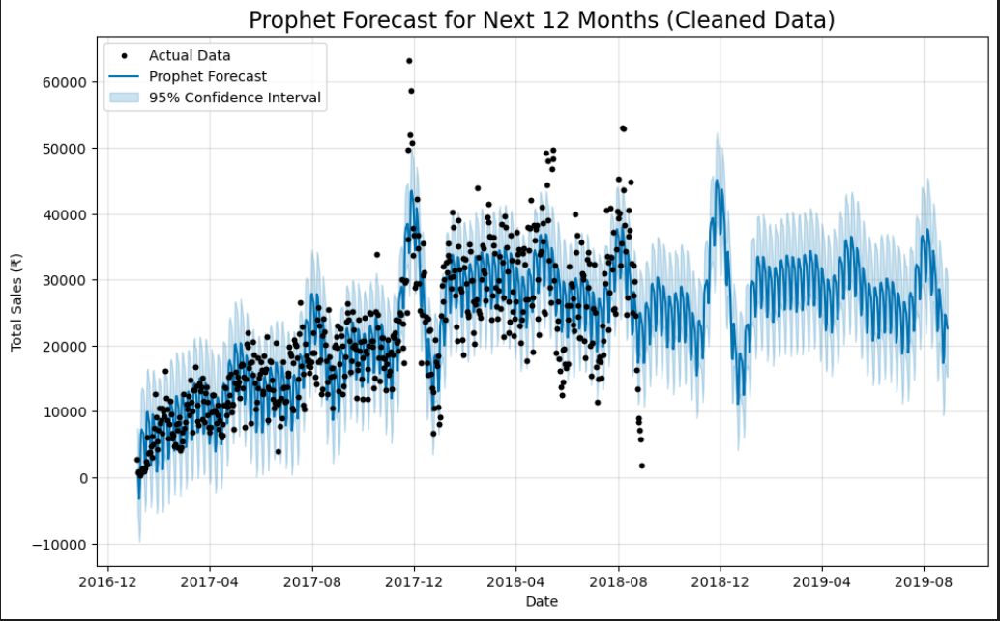

# E-commerce-Analytics-Predictive-Platform-

# 🛒 Olist E-Com Analytics

##  Project Overview
This project uses past data from Olist to find useful insights with the help of data analysis, machine learning, and easy-to-understand visuals made using Power BI.

Key Components of the Project:

- Sentiment Analysis:
Analyzed customer reviews to understand opinions and satisfaction levels.
- Time Series Forecasting:
Predicted future trends like order volume and revenue using historical data patterns.
- Customer, Seller & Product Segmentation:
Grouped customers, sellers, and products based on behavior and characteristics for better targeting.
- Delay Delivery Analysis (Prevention):
Identified and analyzed factors causing delays in delivery using Spark SQL.

##  Project Flow Chart

---

## Preview

---

##  Snapshots

### 1. Power BI Dashboard

### 2. Sentiment Analysis Web App (Flask UI)
 

### 3. Clustering Result Visualization    

 - This clustering is done on basis of total sales a customer had done.  
 - Aim : to Segrigate custumers on basis 
 - Vip Spenders 🔴  
 - High Spenders 🔵  
 - Medium Spenders 🟢  
 - Low / Churned Custumers 🟡      

 - This clustering is done on basis of reviews.  
 - Aim : to Segrigate custumers on basis  
 - Happy 🔵  
 - Mixed 🟠  
 - Unhappy 🟢      

 - This clustering is done on basis of seller had selled its product.  
 - Aim : to Segrigate custumers on basis  
 - Top Performer 🟢  
 - Mid Performer 🔴  
 - Regular Performer 🟠  
 - Dormant Performer 🔵      
 

### 4. Sales Forecast Plot
 

---

##  Goals
- Customer Sentiment Analysis
- Forecasting Sales Trends 
- Delivery Delay Detection
- Understand Customer Buying Patterns
- Dashboard: Visualize Data

---

##  Tech Stack
| Area            | Tools |
|-----------------|-------|
| Programming     | Python, SQL |
| Data Processing | Pandas, Spark SQL |
| ML & DL         | Scikit-learn, ARIMA/SARIMA, Prophet, XGBoost, BERT, Hugging Face |
| Web App         | Flask |
| Dashboard       | Power BI |
| Deployment      | GitHub Actions, AWS, Azure |

---

##  Dataset
Source: [Kaggle - Olist Dataset](https://www.kaggle.com/datasets/olistbr/brazilian-ecommerce)

---

##  Contributors
- Team 007 members
- Guide: Sumit Patil
- Mentor: Prashant Bhosale sir
- Project Lead: Siddhant Sharma
- ML Engineer: Udhav Kardile
- Data Analyst: Muskan Chauhan
- Fronted Developer: Rahul Behra
- Cloud Engineer: Naresh Khanderay
- Data Engineer: Adavit Patil

---

##  Contact
📧 muskanchauhan6065@gmail.com  
🔗 https://www.linkedin.com/in/muskanchauhan6065/

---

##  License
MIT License
